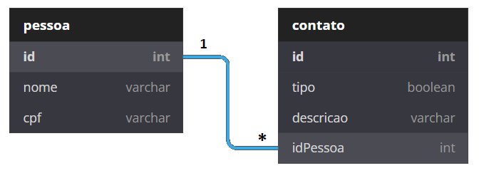

 

 
 

# Teste para vaga de Desenvolvedor Back-end no Magazord.com.br
Este repositório tem como fim testar os candidatos para vaga de desenvolvedor Desenvolvedor Back-end na empresa [Magazord](https://magazord.com.br).
> Para esta vaga buscamos alguém apaixonado por PHP, JavaScript, Banco de Dados, APIs e que tenha facilidade em outras tecnologias e esteja sempre atento aos detalhes!

## O teste

O objetivo deste teste é garantir que suas habilidades de programação sejam postas a prova. 
O importante é o funcionamento e o cumprimento com os requisitos e utilização de boas práticas de programação. 
O visual da aplicação é secundário, não será critério de avaliação.

Será realizado um simples sistema de contatos, utilizando PHP, JS, HTML, CSS e Banco de Dados. 
É necessário que o sistema utilize o padrão MVC e que a manipulação com o banco de dados opere em conjunto com uma ORM chamada Doctrine. 

> [!IMPORTANT]
> **Não utilizar framework's para desenvolver a aplicação back-end**.

> [!IMPORTANT]
> Podem ser utilizados frameworks JS para facilitar o desenvolvimento visual.

> [!NOTE]
> Caso tenha dominio de ferramentas de Container (Docker) incluir o projeto para facilitar a validação do mesmo.

> [!IMPORTANT]
> É de extrema importância um arquivo README para instrução de como executar o projeto.

## Requisitos funcionais:

- RF01 - O sistema deve manter uma tela de consulta para pessoas.

- RF02 - O sistema deve manter um campo de pesquisa por nome de pessoa.

- RF03 - O sistema deve manter uma tela de consulta para contatos.

- RF04 - O sistema deve manter um CRUD (Cadastrar, Visualizar, Alterar, Excluir) para pessoas.

- RF05 - O sistema deve manter um CRUD (Cadastrar, Visualizar, Alterar, Excluir) para contato.

## Requisitos não funcionais:

- RNF01 - O sistema deve utilizar a linguagem PHP para o Back-end.

- RNF02 - O sistema deve utilizar a ORM Doctrine para o Back-end.

- RNF03 - O sistema deve utilizar JS, HTML, CSS.

- RNF04 - O sistema deve ser organizado pelo padrão MVC.

- RNF05 - O sistema deve utilizar o Composer para gerenciamento de dependências.

- RNF06 - O sistema deve utilizar um banco de dados SQL (postgres ou mysql).

- RNF07 - O sistema deverá ter seu controle de versão no Github.

## Regra de Negócio:

- RN01 - São dados de pessoas: Nome e CPF.

- RN02 - São dados de contato: Tipo (Telefone ou Email), Descrição.

- RN03 - Uma pessoa pode ter vários contatos

## Links para documentação de ferramentas utilizadas.

- Composer: https://getcomposer.org/
- Doctrine: https://www.doctrine-project.org/projects/doctrine-orm/en/2.10/index.html

## Envio do teste

* Suba o repositório no seu Github e envie o link diretamente para o seu recrutador.
Obs.: Não serão aceitos alterações após o envio.
